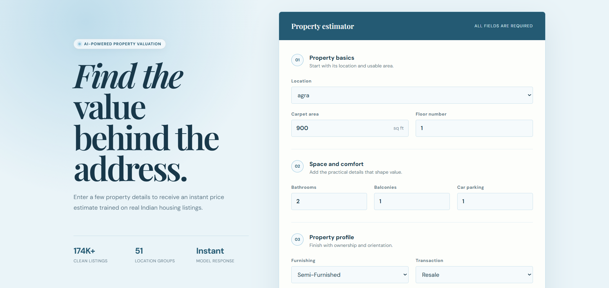

# House Price Prediction

A full-stack application for estimating Indian residential property prices. It cleans and models real housing listings in a Jupyter notebook, serves predictions through FastAPI, and provides a responsive React interface for entering property details and reviewing the estimated value.

> [!IMPORTANT]
> Model predictions are estimates for learning and demonstration purposes. They should support, not replace, professional valuation, market research, or financial advice.

## Interface Preview

### Property estimator



## Features

- Cleans and transforms raw Indian housing-listing data
- Groups infrequent locations and societies to control feature cardinality
- Compares Linear Regression and Random Forest performance
- Exports preprocessing and prediction as one scikit-learn pipeline
- Validates prediction requests with typed Pydantic schemas
- Loads the trained model once during FastAPI startup
- Provides health and prediction API endpoints
- Includes a responsive React and TypeScript property form
- Shows friendly validation and backend-connection errors
- Keeps model, API, and frontend location values synchronized
- Includes backend tests, a production frontend build, and Docker support

## How It Works

```text
House-price CSV
      |
      v
Cleaning and feature engineering
      |
      v
Train/test split and model comparison
      |
      v
Exported scikit-learn pipeline
      |
      v
FastAPI validation and inference
      |
      v
React property estimator
```

The exported pipeline contains the fitted preprocessing steps and Random Forest estimator. The API therefore applies the same transformations used during training before it returns a price estimate.

## Technology

| Component | Purpose |
|---|---|
| Jupyter Notebook | Data exploration, cleaning, training, and evaluation |
| pandas | Dataset manipulation and feature preparation |
| scikit-learn | Preprocessing pipelines and regression models |
| joblib | Trained-pipeline serialization |
| FastAPI | Prediction API and interactive documentation |
| Pydantic | Request validation and environment settings |
| React | Property-estimation interface |
| TypeScript | Typed frontend models and API integration |
| Vite | Frontend development and production builds |
| pytest | Backend endpoint and inference tests |

## Requirements

- Python 3.11
- Node.js with npm
- The source dataset saved as `house_prices.csv`
- The trained `house_price.pkl` artifact generated by the notebook

## Web Application

The interface divides the form into property basics, space and comfort, and property profile sections. It loads supported locations from `locations.json`, sends a typed JSON request to FastAPI, and displays the returned estimate in Indian rupees.

Run the frontend at `http://localhost:5173` and the backend at `http://127.0.0.1:8000`. Both services must be running for prediction requests to succeed.

## Model Performance

The notebook uses an 80/20 train-test split with `random_state=42`.

| Model | Test MAE | Test RMSE | Test R-squared |
|---|---:|---:|---:|
| Linear Regression | INR 3,219,667 | INR 6,295,422 | 0.7367 |
| **Random Forest** | **INR 919,327** | **INR 3,275,913** | **0.9287** |

Random Forest is exported because it produced the lowest test RMSE. Results describe the saved experimental split and may change when the data or training process changes.

## Getting Started

### 1. Clone the repository

```powershell
git clone https://github.com/Nour-Elrouby/House-Price-Prediction.git
cd "House-Price-Prediction"
```

### 2. Prepare the dataset and model

Download the [House Price dataset from Kaggle](https://www.kaggle.com/datasets/juhibhojani/house-price), place it in the repository root as `house_prices.csv`, and run `House Price Prediction.ipynb` from top to bottom.

Copy the generated artifacts into the application folders:

```powershell
Copy-Item house_price.pkl backend/models/house_price.pkl
Copy-Item locations.json backend/models/locations.json
Copy-Item locations.json frontend/public/locations.json
```

The raw CSV and trained model are excluded from Git because they exceed normal GitHub file-size limits.

### 3. Start the backend

```powershell
cd backend
python -m venv .venv
.\.venv\Scripts\Activate.ps1
python -m pip install -r requirements.txt
Copy-Item .env.example .env
uvicorn app.main:app --reload
```

- Health check: `http://127.0.0.1:8000/health`
- Interactive API documentation: `http://127.0.0.1:8000/docs`

A `404` response at `http://127.0.0.1:8000/` is expected because the API does not define a root endpoint.

### 4. Start the frontend

Open a second PowerShell terminal:

```powershell
cd frontend
Copy-Item .env.example .env
npm.cmd install
npm.cmd run dev
```

Open `http://localhost:5173`.

`npm.cmd` avoids the Windows PowerShell execution-policy error that can block `npm.ps1`. In terminals without that restriction, the standard `npm install` and `npm run dev` commands are equivalent.

## API Reference

| Method | Endpoint | Description |
|---|---|---|
| `GET` | `/health` | Confirm that the API is running |
| `POST` | `/predict` | Validate property details and return an estimated price |

### Predict a property price

```bash
curl -X POST "http://127.0.0.1:8000/predict" \
  -H "Content-Type: application/json" \
  -d '{
    "location": "agra",
    "carpet_area_sqft": 900,
    "floor_num": 1,
    "bathroom": 2,
    "balcony": 1,
    "car_parking": 1,
    "furnishing": "Semi-Furnished",
    "transaction": "Resale",
    "ownership": "Freehold",
    "facing": "East"
  }'
```

Example response:

```json
{
  "predicted_price": 12345678.0
}
```

## Configuration

### Backend

| Variable | Default | Description |
|---|---|---|
| `APP_NAME` | `House Price Prediction API` | OpenAPI application title |
| `MODEL_PATH` | `models/house_price.pkl` | Serialized model pipeline |
| `LOCATIONS_PATH` | `models/locations.json` | Supported location values |
| `FRONTEND_ORIGIN` | `http://localhost:5173` | Browser origin allowed by CORS |

### Frontend

| Variable | Default | Description |
|---|---|---|
| `VITE_API_BASE_URL` | `http://localhost:8000` | Prediction API base URL |

## Project Structure

```text
.
|-- House Price Prediction.ipynb       # Cleaning, training, and evaluation
|-- locations.json                     # Exported supported locations
|-- backend/
|   |-- app/
|   |   |-- api/routes/                # Health and prediction endpoints
|   |   |-- core/                      # Application configuration
|   |   |-- schemas/                   # Pydantic request and response models
|   |   |-- services/                  # Preprocessing and inference services
|   |   `-- main.py                    # FastAPI application
|   |-- models/                        # Local generated model artifacts
|   |-- tests/                         # Backend tests
|   |-- .env.example                   # Backend environment template
|   |-- Dockerfile                     # Backend container image
|   `-- requirements.txt               # Python dependencies
|-- frontend/
|   |-- public/                        # Runtime location data
|   |-- src/
|   |   |-- api/                       # Prediction API client
|   |   |-- components/                # Property form
|   |   |-- pages/                     # Home, result, and not-found pages
|   |   `-- styles.css                 # Responsive visual system
|   |-- .env.example                   # Frontend environment template
|   `-- package.json                   # Scripts and dependencies
`-- docs/screenshots/                  # Real application screenshots
```

## Data, Security, and Limitations

- Never commit `.env`, raw dataset files, or serialized model files.
- Validate that the model and location artifacts come from the trusted notebook.
- The API currently has no authentication or rate limiting; add both before public deployment.
- CORS is limited to the configured frontend development origin.
- Predictions can reflect gaps or bias in the source housing listings.
- Retrain and re-evaluate the model as the property market changes.
- Review model output before using it in any real financial decision.

## Development Checks

Run the backend test suite:

```powershell
cd backend
python -m pytest -q
```

Build the production frontend:

```powershell
cd frontend
npm.cmd run build
```

Current project verification:

```text
Backend tests:  3 passed
Frontend build: passed
Fresh clone:    passed
```

## Docker

After generating `backend/models/house_price.pkl`:

```powershell
cd backend
docker build -t house-price-api .
docker run --rm -p 8000:8000 house-price-api
```

## Contributing

Issues and pull requests are welcome. Keep changes focused, do not commit the raw dataset, trained model, environment files, or generated build output, and run the relevant backend and frontend checks before opening a pull request.