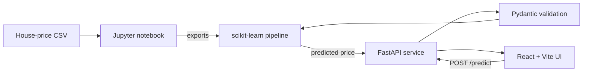

# House Price Prediction

A full-stack machine-learning application that estimates Indian residential
property prices from location and property details. The project includes an
exploratory/model-training notebook, a FastAPI inference service, and a React
interface.

## Architecture



The serialized pipeline contains preprocessing and the trained estimator, so
the API receives human-readable form values and applies the same transformations
used during training.

## Tech stack

- Machine learning: Python, pandas, scikit-learn, joblib, Jupyter
- Backend: FastAPI, Pydantic, Uvicorn, pytest
- Frontend: React, TypeScript, Vite
- Packaging: Dockerfile for the backend

## Project structure

```text
.
├── House Price Prediction.ipynb
├── locations.json
├── backend/
│   ├── app/
│   │   ├── api/routes/
│   │   ├── core/
│   │   ├── schemas/
│   │   ├── services/
│   │   └── main.py
│   ├── models/
│   ├── tests/
│   ├── .env.example
│   ├── Dockerfile
│   └── requirements.txt
└── frontend/
    ├── public/
    ├── src/
    ├── .env.example
    └── package.json
```

The raw CSV and generated `.pkl` files are intentionally ignored because they
are too large for normal GitHub storage.

## Dataset and model preparation

1. Download the [House Price dataset on Kaggle](https://www.kaggle.com/datasets/juhibhojani/house-price).
2. Place the CSV in the repository root and name it `house_prices.csv`.
3. Open `House Price Prediction.ipynb` and run all cells in order.
4. Copy the exported artifacts into the applications:

```powershell
Copy-Item house_price.pkl backend/models/house_price.pkl
Copy-Item locations.json backend/models/locations.json
Copy-Item locations.json frontend/public/locations.json
```

The model artifact is not committed because it is larger than 50 MB. Every
developer should generate it from the notebook before starting the backend.

## Backend setup

Python 3.11 is recommended.

```powershell
cd backend
python -m venv .venv
.\.venv\Scripts\Activate.ps1
python -m pip install -r requirements.txt
Copy-Item .env.example .env
uvicorn app.main:app --reload
```

The API is available at `http://127.0.0.1:8000`, interactive documentation at
`http://127.0.0.1:8000/docs`, and health status at
`http://127.0.0.1:8000/health`. A `404` response at `/` is expected because the
API does not define a root route.

### Backend environment variables

| Variable | Default | Purpose |
|---|---|---|
| `APP_NAME` | `House Price Prediction API` | OpenAPI application title |
| `MODEL_PATH` | `models/house_price.pkl` | Serialized pipeline path |
| `LOCATIONS_PATH` | `models/locations.json` | Supported locations path |
| `FRONTEND_ORIGIN` | `http://localhost:5173` | Browser origin allowed by CORS |

## Frontend setup

Node.js includes npm and is required to build this React project.

```powershell
cd frontend
Copy-Item .env.example .env
npm.cmd install
npm.cmd run dev
```

Open `http://localhost:5173`. `npm.cmd` is used here because some Windows
PowerShell execution policies block `npm.ps1`. In terminals without that
restriction, the usual `npm install` and `npm run dev` commands are equivalent.

### Frontend environment variables

| Variable | Default | Purpose |
|---|---|---|
| `VITE_API_BASE_URL` | `http://localhost:8000` | Base URL of the prediction API |

Both servers must be running at the same time. If the interface reports that it
cannot connect, verify `http://127.0.0.1:8000/health` first.

## API reference

### `GET /health`

```json
{"status": "ok"}
```

### `POST /predict`

Example request:

```bash
curl -X POST "http://127.0.0.1:8000/predict" \
  -H "Content-Type: application/json" \
  -d '{
    "location": "Mumbai",
    "carpet_area_sqft": 1200,
    "floor_num": 5,
    "bathroom": 2,
    "balcony": 1,
    "car_parking": 1,
    "furnishing": "Semi-Furnished",
    "transaction": "Resale",
    "ownership": "Freehold",
    "facing": "East"
  }'
```

Example response:

```json
{"predicted_price": 12345678.0}
```

The response value is an estimate in Indian rupees.

## Model results

The notebook uses an 80/20 train-test split with `random_state=42`.

| Model | Test MAE | Test RMSE | Test R² |
|---|---:|---:|---:|
| Linear Regression | ₹3,219,667 | ₹6,295,422 | 0.7367 |
| Random Forest | **₹919,327** | **₹3,275,913** | **0.9287** |

Random Forest is exported because it has the lower test RMSE. Metrics describe
the saved experimental split and are not a guarantee for unseen market data.

## Verification

Run the automated backend tests:

```powershell
cd backend
pytest -q
```

Build the production frontend:

```powershell
cd frontend
npm.cmd run build
```

## Screenshots

After starting both services, capture the completed form and prediction result
as `docs/screenshots/home.png` and `docs/screenshots/result.png`, then embed them
here before publishing the repository.

