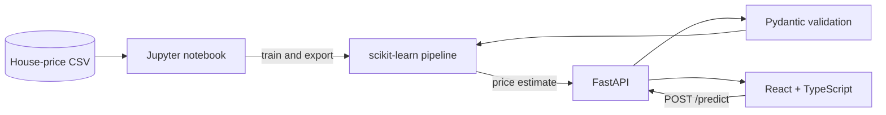

<div align="center">

# House Price Prediction

### End-to-end property valuation with machine learning

Predict residential property prices through a polished React interface backed
by a production-ready FastAPI service and a scikit-learn pipeline.

[](https://www.python.org/)
[](https://fastapi.tiangolo.com/)
[](https://react.dev/)
[](https://www.typescriptlang.org/)
[](#quality-checks)

</div>

## User interface


## Overview

This project turns a house-price experiment into a complete web product. The
notebook cleans the source data, engineers reusable features, compares
regression models, and exports the best pipeline. FastAPI loads that pipeline
once at startup, while React provides a responsive form and a clear prediction
result.

### Highlights

- Reproducible preprocessing and training in a human-readable Jupyter notebook
- Random Forest model selected by test RMSE
- Shared scikit-learn pipeline for preprocessing and inference
- Typed and validated prediction requests with Pydantic
- Friendly API connection and validation errors in the React interface
- Responsive professional UI based on `#92C5DE`
- Backend tests, production frontend build, and Docker support

## Architecture



The serialized model contains both feature preprocessing and the estimator.
This keeps training and production inference consistent.

## Model performance

The notebook uses an 80/20 train-test split with `random_state=42`.

| Model | Test MAE | Test RMSE | Test R-squared |
|---|---:|---:|---:|
| Linear Regression | INR 3,219,667 | INR 6,295,422 | 0.7367 |
| **Random Forest** | **INR 919,327** | **INR 3,275,913** | **0.9287** |

Random Forest is exported because it achieved the lowest test RMSE. These
metrics describe the saved experimental split and do not guarantee future
market performance.

## Project structure

```text
.
|-- House Price Prediction.ipynb
|-- locations.json
|-- backend/
|   |-- app/
|   |   |-- api/routes/       # HTTP endpoints
|   |   |-- core/             # Application settings
|   |   |-- schemas/          # Request and response models
|   |   |-- services/         # Preprocessing and inference
|   |   `-- main.py           # FastAPI application
|   |-- models/               # Local generated artifacts
|   |-- tests/
|   |-- .env.example
|   |-- Dockerfile
|   `-- requirements.txt
|-- frontend/
|   |-- public/
|   |-- src/
|   |   |-- api/
|   |   |-- components/
|   |   |-- pages/
|   |   `-- styles.css
|   |-- .env.example
|   `-- package.json
`-- docs/
    `-- images/
```

## Quick start

### Prerequisites

- Python 3.11
- Node.js with npm
- The trained model artifact generated from the notebook

### 1. Clone the project

```powershell
git clone https://github.com/Nour-Elrouby/House-Price-Prediction.git
cd "House-Price-Prediction"
```

### 2. Prepare the dataset and model

Download the [House Price dataset from Kaggle](https://www.kaggle.com/datasets/juhibhojani/house-price),
place it in the project root as `house_prices.csv`, and run
`House Price Prediction.ipynb` from top to bottom.

Copy the generated artifacts:

```powershell
Copy-Item house_price.pkl backend/models/house_price.pkl
Copy-Item locations.json backend/models/locations.json
Copy-Item locations.json frontend/public/locations.json
```

> The raw CSV and trained model are intentionally excluded from Git because
> they exceed normal GitHub file-size limits.

### 3. Start the backend

```powershell
cd backend
python -m venv .venv
.\.venv\Scripts\Activate.ps1
python -m pip install -r requirements.txt
Copy-Item .env.example .env
uvicorn app.main:app --reload
```

Backend links:

- Health check: `http://127.0.0.1:8000/health`
- Interactive API docs: `http://127.0.0.1:8000/docs`

A `404` response at `http://127.0.0.1:8000/` is expected because the API does
not define a root endpoint.

### 4. Start the frontend

Open a second PowerShell terminal:

```powershell
cd frontend
Copy-Item .env.example .env
npm.cmd install
npm.cmd run dev
```

Open `http://localhost:5173`.

`npm.cmd` avoids the Windows PowerShell execution-policy error that can block
`npm.ps1`. Where that restriction is not present, `npm install` and
`npm run dev` work normally.

## API reference

### Health check

```http
GET /health
```

```json
{
  "status": "ok"
}
```

### Predict a price

```http
POST /predict
Content-Type: application/json
```

Example payload:

```json
{
  "location": "Mumbai",
  "carpet_area_sqft": 1200,
  "floor_num": 5,
  "bathroom": 2,
  "balcony": 1,
  "car_parking": 1,
  "furnishing": "Semi-Furnished",
  "transaction": "Resale",
  "ownership": "Freehold",
  "facing": "East"
}
```

Example response:

```json
{
  "predicted_price": 12345678.0
}
```

The predicted value is expressed in Indian rupees.

## Configuration

### Backend

| Variable | Default | Description |
|---|---|---|
| `APP_NAME` | `House Price Prediction API` | OpenAPI application title |
| `MODEL_PATH` | `models/house_price.pkl` | Serialized model pipeline |
| `LOCATIONS_PATH` | `models/locations.json` | Supported location values |
| `FRONTEND_ORIGIN` | `http://localhost:5173` | Origin allowed by CORS |

### Frontend

| Variable | Default | Description |
|---|---|---|
| `VITE_API_BASE_URL` | `http://localhost:8000` | Prediction API base URL |

## Quality checks

Run the backend test suite:

```powershell
cd backend
python -m pytest -q
```

Create a production frontend build:

```powershell
cd frontend
npm.cmd run build
```

Current verification:

```text
Backend tests:  3 passed
Frontend build: passed
Fresh clone:    passed
```

## Docker

After generating `backend/models/house_price.pkl`:

```powershell
cd backend
docker build -t house-price-api .
docker run --rm -p 8000:8000 house-price-api
```

## Notes

- Predictions are estimates and should not be treated as financial advice.
- The model reflects patterns in the training dataset and may require
  retraining as property markets change.
- Location values are kept synchronized between the model, API, and frontend.

---

<p align="center">
Built by <a href="https://github.com/Nour-Elrouby">Nour Elrouby</a>
</p>
